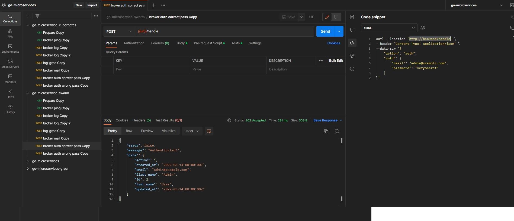

##### Running project using Docker Swarm

1. [Building and pushing images to Docker Hub](build_and_push_images_to_dockerhub.md)
2. Change directory to project
3. Building and pushing micro-caddy ([caddy.dockerfile](../../caddy.dockerfile))
 Ex:
 docker build -f caddy.dockerfile -t eric6166/micro-caddy:1.0.0 .
 docker push eric6166/micro-caddy:1.0.0
4. Change image in file [swarm.yml](../../swarm.yml)
5. Starting project ([swarm.yml](../../swarm.yml))
   1. docker stack deploy -c swarm.yml <app_name>
    Ex: docker stack deploy -c swarm.yml myapp
     
6. Scaling services
   1. docker service scale <service_name>=<replicas_number>
    Ex: docker service scale myapp_listener-service=3   
7. Updating service
   1. docker service update --image <dockerhub_id>/<image_name>:<tag_name> <service_name>
    Ex: docker service update --image eric6166/logger-service:1.0.1 myapp_logger-service
8. Stop service and leave swarm
   1. docker stack rm <app_name>
    Ex: docker stack rm myapp
   2. docker swarm leave -f
9. Prepare data, Postman collection & environment and testing frontend
   1. Prepare data for authentication-service, run [users.sql](../sql/users.sql) 
   2. [Postman collection - docker swarm](../postman/go-microservice-swarm.postman_collection.json)
   3. [Postman environment](../postman/go-microservices.postman_environment.json)
   4. Testing
     
     
