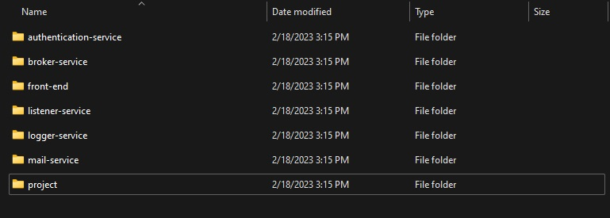
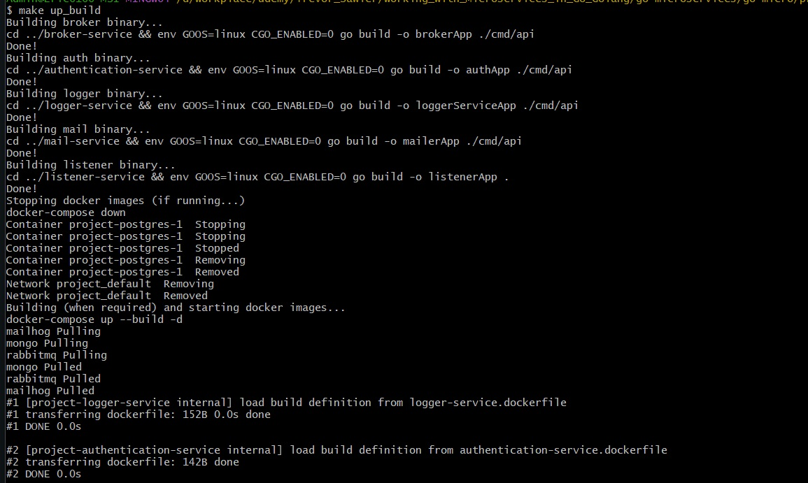
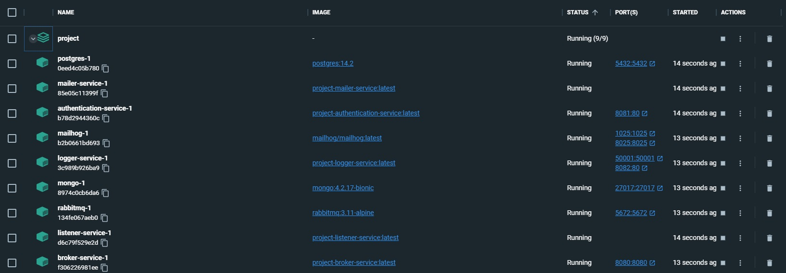
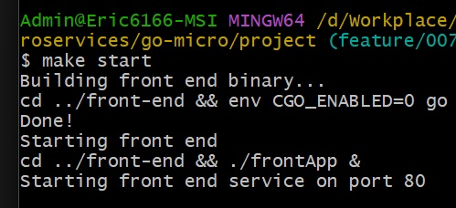
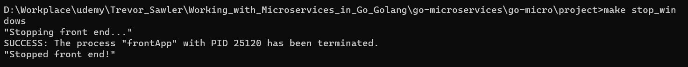
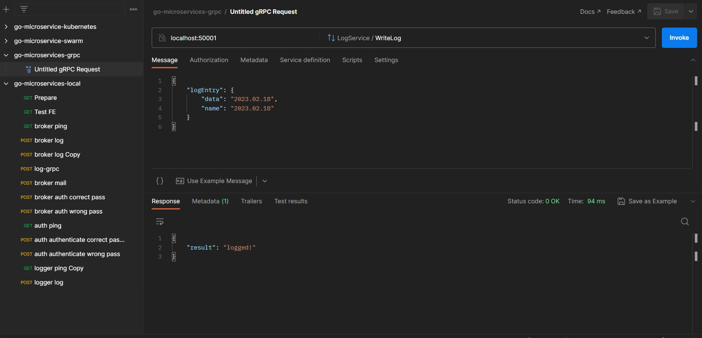
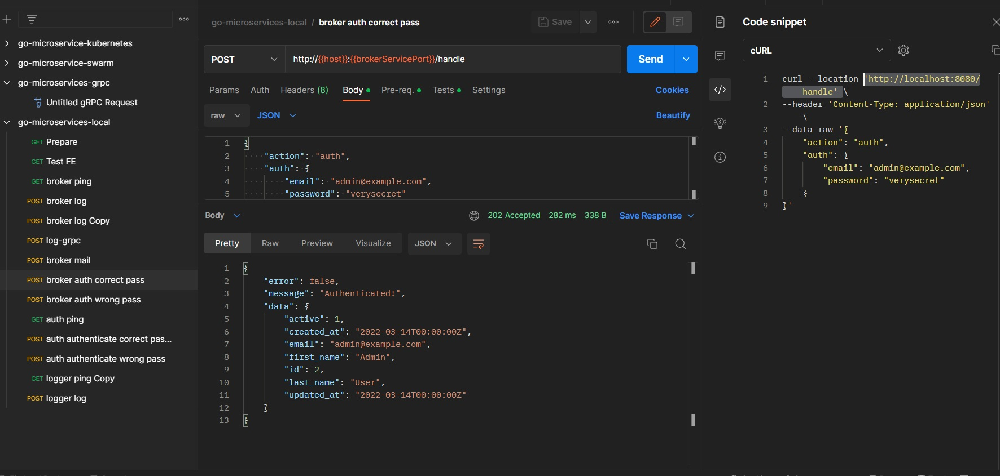
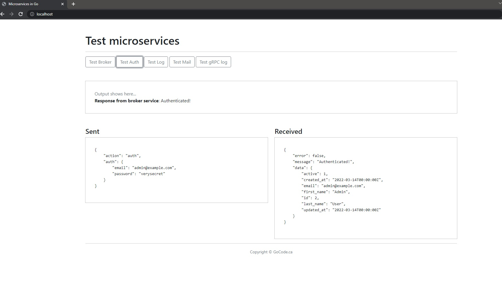

##### Running project local

1. Clone from [all repos](all_repos.md)
    
2. Run command in [Makefile](../../Makefile)
   1. Change directory to project
   2. Build and run all backend services
    make up_build
    
    
   3. Build and run frontend
      1. Check out to branch: feature/0047-updating-the-front-end-code 
      2. make start
       
   4. Stop frontend
      1. If using Windows, using cmd
      2. make stop_windows
          
   5. Stop backend
      1. make down
   6. Prepare data, Postman collection & environment and testing frontend
      1. Prepare data for authentication-service, run [users.sql](../sql/users.sql)
      2. [Postman collection - local](../postman/go-microservices-local.postman_collection.json)
      3. [Postman environment](../postman/go-microservices.postman_environment.json)
      4. Testing
        
        
        